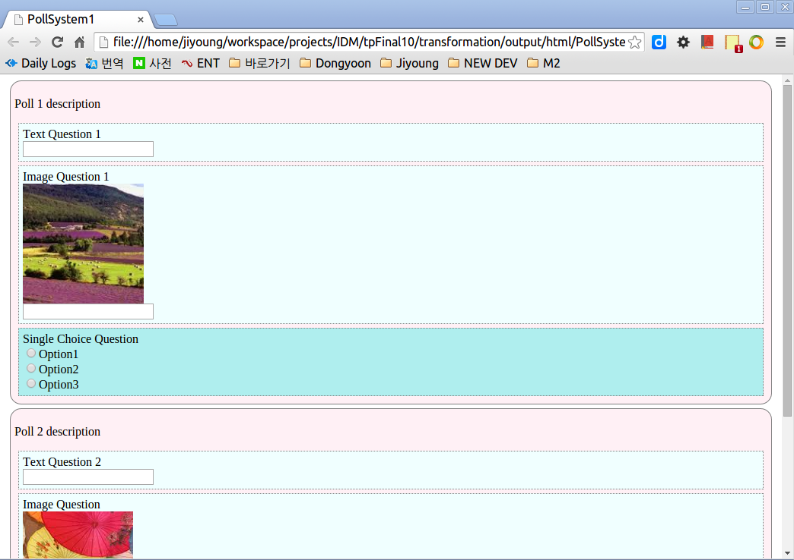
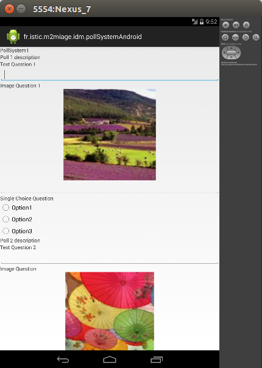

====
IDE TP Final

## projects :
 * fr.istic.m2miage.idm.pollSystem --> data structure dsl
 * fr.istic.m2miage.idm.css --> presentation dsl
 * UIMM : UI Model (ecore model project)
 * transformation : Model to Model, Model ti Text transformation

## DSL examples

// pollsystem

    PollSystem PollSystem1 {
	Poll poll1 {
		description : "Poll 1 description" 
		TextQuestion tq1 {
			text "Text Question 1"
		}
		ImageQuestion iq1 {
			text "Image Question 1"
			imagePath : "img1"
		}
		SingleChoiceQuestion scq1 {
			text "Single Choice Question"
			Options {
				() o1 option : "Option1" value : "Value1"
				() o2 option : "Option2" value : "Value2"
				() o3 option : "Option3" value : "Value3"
			}
		}
	}	
    }

// style

	PollStyle Name {
		bgColor : LavenderBlush
		borderType : RoundedBox
	}

	SingleQuestionStyle SQS {
		bgColor : PaleTurquoise 
		borderType :  Dotte
	}

	MultipleQuestionStyle MQS{
		bgColor : LightGreen
		borderType : Dotte
	}

	TextQuestionStyle TQ {
		bgColor : Azure
		borderType : Dotte
	}

## how to test : 
  1. in the 'transformation' project, I prepared 'resources/PollSystem.ps' and 'resources/Style.css'
  2. 'transformation/test/fr/istic/m2miage/idm/transformation.xtend'  --> generateAll()
  3. output files : 
     - 'transformation/output/hhml' --> html file
     - 'transformation/output/android' --> android classes (copy this outputs into a android project to test them)
     - 'transformation/output/xmi' --> xmi model (uimm model)

## screen shots : 

HTML 

Android

